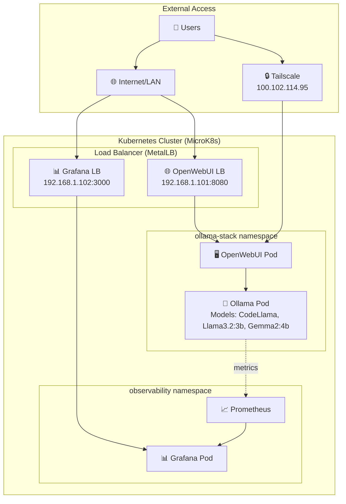

# Ollama Kubernetes Stack

🚀 **Enterprise-ready Kubernetes deployment for Ollama AI stack**

[](https://github.com/your-org/ollama-kubernetes-stack/actions)
[](https://helm.sh)
[](https://kubernetes.io)
[](LICENSE)

## ✨ Features

- 🤖 **Ollama AI Server** - Local LLM inference (CodeLlama, Llama3.2:3b, Gemma2:4b)
- 🌐 **OpenWebUI** - Beautiful web interface for AI interactions
- 📊 **Grafana** - Real-time monitoring and metrics dashboard
- 🔒 **Tailscale** - Secure remote access via mesh networking
- ☸️ **Kubernetes** - Cloud-native orchestration and scaling
- 📦 **Helm** - Professional package management
- 🔄 **GitOps** - Infrastructure as Code with CI/CD

## 🚀 Quick Start

```bash
# One-click installation
./scripts/install.sh

# Access your AI stack
open http://192.168.1.101:8080  # OpenWebUI
open http://192.168.1.102:3000  # Grafana
```

## 🏗️ Architecture

Your stack runs on:
- **Hardware**: AMD Ryzen AI 9 HX 370, 96GB
- **Storage**: 1TB NVMe SSD at `/mnt/evo4t`
- **Network**: LoadBalancer services + Tailscale mesh
- **Monitoring**: Prometheus + Grafana dashboards



## 📋 Current Status

✅ **Phase 1 Complete**: Infrastructure as Code deployed  
✅ **Phase 2 Complete**: Enterprise repository structure  
✅ **Phase 3 Complete**: Architecture diagrams & documentation  

## 📖 Documentation

- **[Installation Guide](docs/deployment/installation.md)** - Complete setup instructions
- **[Architecture Overview](docs/architecture/overview.md)** - System design and components
- **[Operations Manual](docs/operations/)** - Day-2 operations and maintenance
- **[Development Guide](docs/development/)** - Contributing and development setup

## 🛠️ Available Models

Your deployment includes these AI models:
- **CodeLlama** - AI model capabilities
- **Llama3.2:3b** - AI model capabilities
- **Gemma2:4b** - AI model capabilities

## 🔧 Management Commands

```bash
# Check system status
./scripts/system-status.sh

# Add new AI models
./scripts/add-ollama-model-script.sh

# Download coding models
./scripts/download-coding-models.sh

# View deployment status
kubectl get pods -n ollama-stack
kubectl get services -n ollama-stack
```

## 🤝 Contributing

We welcome contributions! See [CONTRIBUTING.md](CONTRIBUTING.md) for:
- Development setup
- Code standards
- Testing procedures
- Release process

## 📄 License

This project is licensed under the MIT License - see [LICENSE](LICENSE) for details.

## 🆘 Support

- 📖 **Documentation**: Check the `docs/` directory
- 🐛 **Issues**: [GitHub Issues](https://github.com/your-org/ollama-kubernetes-stack/issues)
- 💬 **Discussions**: [GitHub Discussions](https://github.com/your-org/ollama-kubernetes-stack/discussions)

---

**Generated on**: 2025-07-26  
**Powered by**: Kubernetes • Helm • Ollama • OpenWebUI • Grafana • Tailscale
