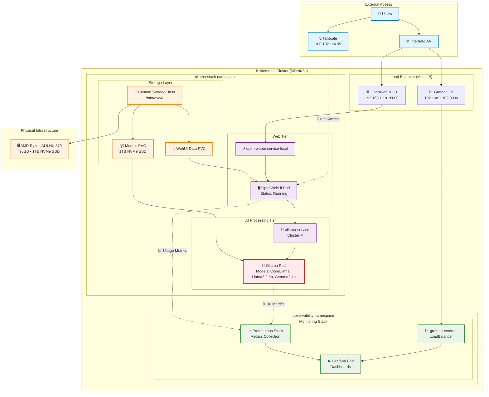
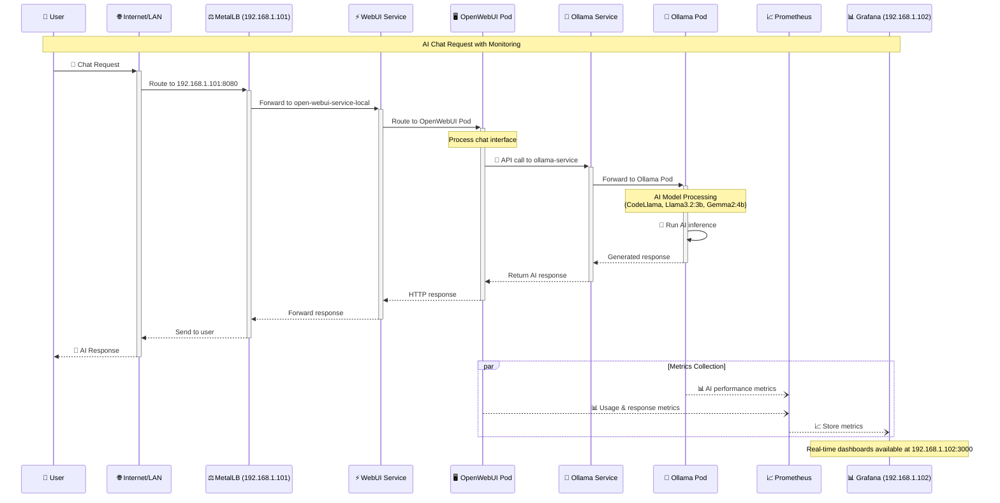
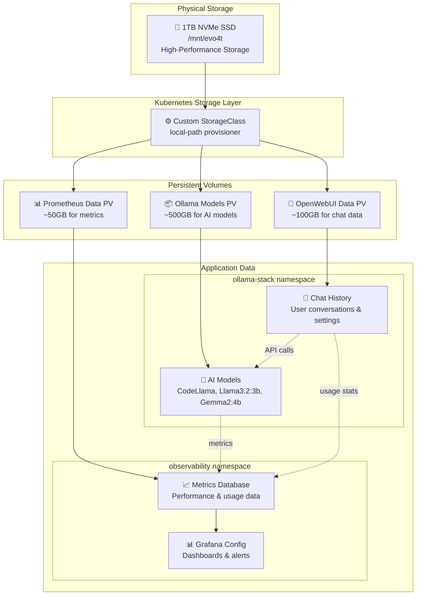
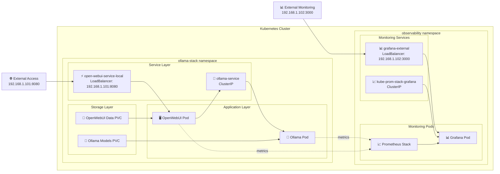

# System Architecture - Mermaid Diagrams

## 🏗️ Complete System Architecture

## 🔄 Request Processing Flow

## 🗄️ Storage & Data Architecture

## 📊 Namespace Overview

---

**Generated on**: 2025-07-26
